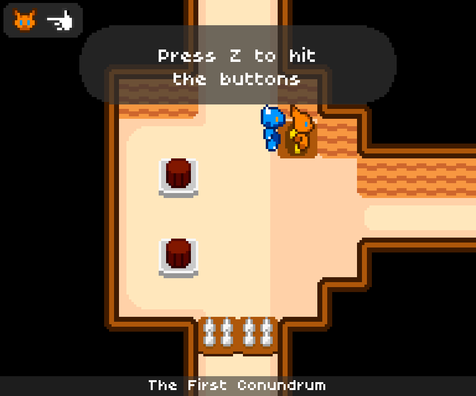
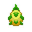
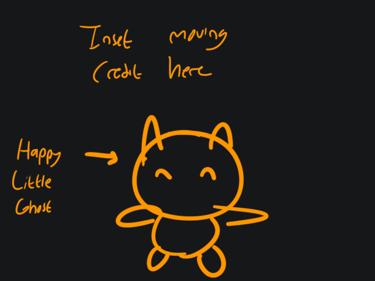

These are the tasks that we're taking for the week May 3rd until May 9nd. Please make sure you have completely finished your last week task before continuing this week's task.

Note that for specified task, there will be no task that adds new element that greatly affects the level design due to time constraint. You should focus on using every element you have created previously for the last 10 levels in the game.

The last week will be spent on anything outside of Godot/Code editor such as GDD, Post-Mortem (idk what this is), etc.

# Table of Content
- [Mandatory Task](#mandatory-task)
- [Specified Task](#specified-task)
- [Selectable Task](#selectable-task)
	- [Tutorial Box](#tutorial-box)
	- [Music](#music)
	- [The Win Level](#the-win-level)
	- [Credit Screen](#credit-screen)

# Mandatory Task
As usual, every team member creates 2 levels per person. While the order doesn't matter for now, each person takes the level number provided below which serve as the level's filename and it should prevent any clashing filename during merging. Once all 30 levels are created, all levels will be ordered by its judged difficulty and complexity. 

Please choose the level number you want to pick on Discord:
- Level 21-22
- Level 23-24
- Level 25-26
- Level 27-28
- Level 29-30

Since you are making the last 10 levels, it should present the true challenge that will test every single thing the player has learned so far. It will be a difficult challenge, but not impossible. Reminder that we're making a challenging, yet encouraging game like Celeste. NOT an annoying, rage-inducing game like Cat Mario. Refer back to the guideline document on how to make your level good to play and avoid "spiteful" game design.

# Task for me

### 1. Animated title screen
Part of the final deliverable for the game is to create a "poster" for the game which I interpret it as the artwork for the game (e.g. for Itch.io thumbnail). The good news is that this same artwork will be used as the title screen for the game. 

The "Animation" in this context is not on the image itself but rather the image transition. There will be two layers of image that will scroll throguh whent the game start (which you can skip of course). The background layer will be the view of the tree at a distance and the foreground layer will be the little ghost who looks at its tree top.

[The intro scene from *Avatar: The Last Airbender (GBA)* is a good reference of what I'm talking about. Just ignore the animation on Aang's shirt](https://www.youtube.com/watch?v=dfu4FHh4HEo&t=21).

#### 2. Code Refactoring
A simple code refactoring is done to tidy up some codebase and remove some potential code smell. This is mostly done at `player.gd` but I may touch other scripts too.

#### 3. Level balancing
Ensuring every level is playable and nothing is against the Level Design in the guideline document. This means I may need to change how level works and its name as well. Ordering level may happen as well.

#### 4. Visual Assets
I still haven't done touching up the game's general visual asset yet. I will focus on it for this week.

# Selectable Task
I plan to include "saving" as part of this week's task. However, it has been done before I even tell you how it's supposed to be done (and that's awesome). I decide to give you one task I supposed to do myself. You know what to do.

If you have a question or there's something that's not clear, please ask me on Discord. I don't want you to deliver the task with something that's not in my mind and I can't expect you to read my mind exactly so I'll try to be as clear as possible for my given tasks.

### Tutorial Box
Tutorial should be added for better accessibility and communication to the player. At the same time, we don't want to annoy the player with too many tutorial or pop-up boxes that disrupts the flow of the gameplay. 

The tutorial box will display a pop up message at the top of the screen telling the player about the game mechanic. The player simply needs to walk onto it to read the message without any interaction prompt or pausing, preventing the gameplay flow of being broken.

The tutorial box needs to be placed sparingly (only few levels has them), and it should tell the player about the control and mechanic of the game. Examples messages are as follow:
- Tell the player the control and how to strike
- Hold down "S" to lower the height gain from striking
- About those diamonds...

Sometimes, it's best to let the player learn from experience. But some mechanic isn't too obvious to the player and can't be known quickly without telling the player explicitly. Hence the need of tutorial box.

Criteria:
- Find or create a simple 16x16 sprite. Put a question mark in the middle.
- There will be two separate objects: TutorialBox and MessageBox. The TutorialBox can be placed anywhere in the level but MessageBox MUST be in the same place regardless of the level and be put as the child of CanvasLayer that every level has.
- Make TutorialBox as Area2D as the player simply needs to physically touch it in order to read the tutorial. The object will stay there and can NOT be destroyed.
- The MessageBox should appear as soon as the player touches the TutorialBox and disappear as soon as the player leaves it. Use signal to trigger the MessageBox's visibility.
- There should be a dark, transparent panel behind the text for better readability. A simple rectangle is sufficient.
- The text box should only have two lines and each line is a separate label object. Create exportable variables that changes these two lines so each level can have different message.
- The font must use the poco font provided in the asset folder with the size of exactly 20 pixels.

The following is how the tutorial box should look like when being interacted. Taken from my previous game "Katgon Dungeon"

### Music
The game will have four music for the following part of the game:
1. Main Menu
2. First Game Music (for level 1-20)
3. Second Game Music (for level 21-30)
4. Credit

Find four music tracks that will fit to the theme of the game. Make sure all music used are in the same genre. The genre I recommend is either chiptune or electronic. Artist doesn't matter though using multiple music from the same artist is a plus (just credit them, please).

There are multiple sources to find music. I can't tell you which site but I recommend to start searching on Youtube, Bandcamp, Itch.io, or opengameart.org.

After that, put all music into `res://globals/audio.tscn` as `AudioStreamPlayer` with "Music" as its audio bus (so the volume can be changed in the setting). You need to ~~code yourself the change music function~~ use the `music_play()` function in the `Audio` scene and the places of which the music will change across multiple scenes. The recommended places are as follows: 

- `main_menu` for menu music
- `level1` for first game music
- `level21` for second game music
- `credit` for credit music.

For modifying level's script, make sure you do either of the following:
- extends their script to extend the `LevelClass` class that all levels share.
- Modify `level_class.gd` directly but only change music when the level number is either 1 or 21.

Criteria:
- The file format should be in either mp3 or ogg format for smaller file size.
	- Try convert it into two file format and use the smaller one.
- The music should changes as soon as the player enters the mentioned scenes.
- ~~Try to make the music transition go smoothly. Use crossfading effect that can be achievable using tweens.~~ Has been handled in `music_play()`.
- All music MUST be royalty-free and has license that allows free usage and redistribution such as Creative Commons (CC) License. If the song doesn't specify its license in the description, by default, you don't have the artist's permission to use it. You may have to write a written permission to the artist and get their permission. If you do, please send me your written permission AND their response in my DM.
	- Please avoid paying for any music as paid music usually doesn't have royalty-free license to begin with. **Pirating paid music for our game is strictly forbidden**.
- Don't use music from the following sources:
	- NoCopyrightSounds: I fucking hate them.
	- Incompetech/Kevin MacLeod: Please Be more creative.
- Don't forget to credit the song artist in a text file. This is important for the credit screen at the next task.
	- See the `CREDIT.txt` file in `assets/audio` folder.

### The Win Level
Technically named as "Level#31", this will be the "level" that contains the fruit of life as described in GDD. As soon as the player touches the fruit, the game will transition to the credit screen which will be described later. Don't worry about visual or animation, that will be the one I'll do myself.

Criteria:
- I'll provide a temporary `fruit_of_life_temp.png` that you can use. It'll be 64x64 in size. 
- Try to make the level look like a tree top. The fruit will be in the middle and all you have to do is to jump onto it to finish the game.
- Make sure the side wall only cover 1/3 to 2/3 of available space from the bottom continuously and nothing covers the ceiling. Put invisible collision outside of the viewport to prevent the player from going out of bound. remove any "WinZone" to prevent the player from going into a non-existent "Level#32" and crash the game.
- Pause the stopwatch timer (`GameStopwatch.pause = true`) and set `Global.has_started_game` and `Global.game_running` to false as the player touches the fruit.

Here's the temporary sprite image:

### Credit Screen
This is the screen that appears after taking the fruit of life as described previously.

The credit screen will be divided by two part. The top part and the bottom part. The top part is where the text is laid out and the bottom part is a static image of a happy ghost as a human. Use this as a temporary image for the credit screen (cover the text if needed)

The text content is as follow (there will be five pages):

1. "Congratulation! You have reached the fruit of life and recieve the gift of a physical body. Now how do you get off from the tree top?"
2. Team Bunglon: Just list our name, Github user or real name. Credit me as "Rayhan Ryu" as a pseudonym. Don't include student ID.
3. Asset Credit: Every single external assets that the game uses.
	- Stopwatch Addon by GuaraProductions
	- Sound Effect by Juhani Junkala
	- [Music Name] by [Composer Name]
		- There might be at most 4 lines for music credit depending if there are multiple music that are composed by the same artist.
4. Technology Used: Godot 4 and Aseprite.
5. "Thank you for playing"

Once the player reaches the fifth page and press the continue button, they will be brought back into the main menu.

The bottom left or bottom right corner will have all values the pause menu has for showing the following:
- How many collectibles the player has obtained. (`Global.collectibles`)
- How many deaths the player has experienced. (`Global.death_count`)
- The time to reach the fruit since the start of the game. (`GameStopwatch.get_elapsed_time_in_seconds()`)

Criteria:
- Once again for clarity: **CREDIT ME AS "Rayhan Ryu" PLEASE.**
- All font must be poco font with the size of 20.
- The number of line doesn't matter as long as it fits the upper half of the image and doesn't obscure the image of the happy ghost.
	- Use VBoxContainer and multiple label nodes. Don't use line break (enter) as its margin using Poco Font is terribly huge.
- Use any transistion animation when switching to the next credit page (swipe, crossfade, etc.)
- Use `ui_accept` (Space, Enter, or Z) as the button to go to the next page. 
- Give each page a timer (at least 1 second) that disables the input until timeout to prevent the player spamming the accept button and give the credit text a chance to be read.
	- One timer node is all that is needed.
