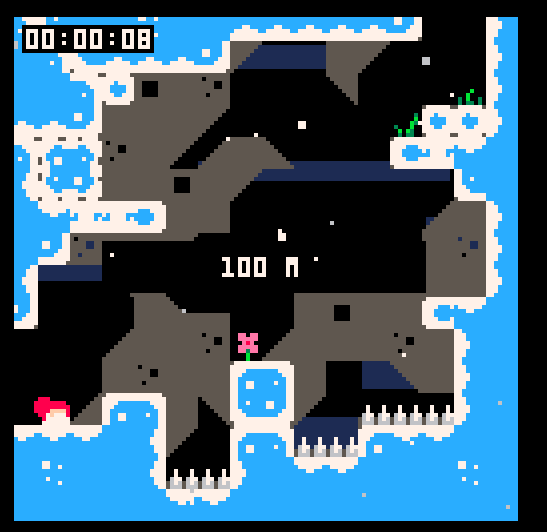
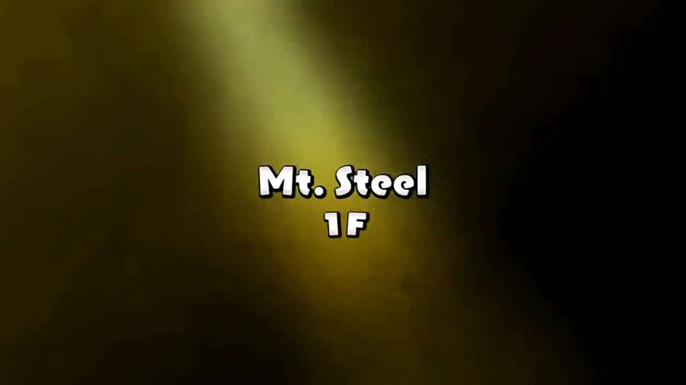
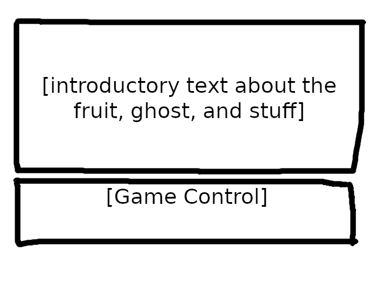

These are small tasks that we're taking for the final week of the development. This document will be brief as the selectable task (which is in Godot editor) is very small and we should focus on wrapping up our games with other non-editor stuff (GDD, Pitching, Trailer, all that stuff).

The deadline will be just before thursday at 18:00 so that the rest of the night can be spent on fixing bugs and improving codes.

# Table of Content
- [Mandatory Task](#mandatory-task)
- [Specified Task](#specified-task)
- [Selectable Task](#selectable-task)
	- [Level Notification](#level-notification)
	- [Prologue](#prologue)
	- [The Hardest Level and Number of Strike](#the-hardest-level-and-number-of-strike)

# Mandatory Task
1. Please playtest the whole game and find if there's anything that prevents the player from finishing all levels (e.g. Bugs). I won't accept any other MR on level edit unless you have a clear reason why you want to edit your level
2. We must update GDD with the latest information about the game and the assets we have created.
3. Pitching video would be done around Friday
4. Post-Mortem will be announce later.

# Specified Task

### Rayhan
Finalizing visual art for the following:
1. In-game logo, the current logo will be used for itch.io page and press kit.
2. Background for Level 11-20	
3. Background for Level 21-30
4. All visual assets for Fruit of Life and its background.
5. Finalizing credit sequence.
6. Prologue Image.
7. Possibly some interlude level (just after level 10 and 20). These won't count as an actual level and they only serve as a "rest stop" for the player.

### Naufal
Make a video trailer using the level on the latest commit at `main` for around 30 seconds to 1 minute. You must create the footage on your own (or ask other) of any level. You should start recording now as, once the background graphic is finished, you can re-record those level and replace the old clip with the new clip in your video project file.

Make sure the video is uploaded to your Youtube channel unlisted. Thumbnail is irrelevant but feel free to use the thumbnail used for the itch.io page after it is published.

# Selectable Task
There will be three task for each team member except Naufal to pick freely. This shouldn't be too much work.

### Level notification
A small box in the center of the screen that's briefly shown when the player enters a new level. The content of the banner is as follows:

- Line 1: The Root/The Trunk/The Branch/The Fruit
- Line 2: [N]F (where [N] is the level number)
 
The first line refers to the group of level as the following:
- The Root: Level 1-10
- The Trunk: Level 11-20
- The Branch: Level 21-30
- The Fruit: Level 31

The second line is the level number itself. Note that "Level" will be referred to as "Floor" in this manner. e.g. Level 10 is referred to as "10F"

Criteria:
- Use the graphic akin to `MessageBox` with Poco Font of 20px and two separate label object for the lines.
- It only appears when the player enters a new level or presses the "continue" button from the main menu. Not by restarting the level by dying or pressing the restart button.
- The time it appears should be brief. Probably around 1.0 second or so.

The following is the example of how it looks in Celeste Classic:  

This one is how the text appears in PMD (Rescue Team DX specifically):  

### Prologue
When the player presses "Start", they will be greated with the prologue, explaining about the fruit of life and introducing the ghost as the protagonist and his motivation of reaching the fruit. At the bottom, the game will explain the control such as movement, jump, restart, and striking. The background is the artwork of the fruit itself. The player can then press the confirm button (Space, Enter, or Z) to start the game.

I couldn't give the text at the moment so please write it yourself for the time being. Do NOT copy-paste from GDD as the introduction part should be brief. Nobody likes to read a wall of text.

Criteria:
- The Prologue only shows when the player presses the "Start" button in the main menu (and after pressing "yes" on the confirmation screen if a game has started before). It will not show when the player presses the "Continue" button in the main menu or restarting the game through the pause menu.
- This prologue should be its own scene. You can set it as the child node of `MainScreen` or switch the scene entirely.
- The text, as usual, is Poco with 20px. Use separate label node as a line break.
- If the prologue image hasn't been created yet, a simple white image of 640x480 is sufficient.
- Feel free to do any animations the prologue may have yourself (such as text scrolling effect). I can't tell you how the animation would play out exactly so be creative.
- The player should be able skip any animation when entering the scene by pressing the confirm button.
	- This means the player has to press the confirm button twice to start the game quicker.
- **Do not use mouse input under any circumstances**. This includes using Godot's button node. It should be clear at this point that this game is exclusively operated using the keyboard.
- The Ghost's pronouns are he/him.

The following is the mockup of how the prologue's text should be laid out. Note that the border is only for visualization. The actual prologue shouldn't have any border around its text.

### The Hardest Level and Number of Strike
This are variables inside `global.gd` that keeps track of the hardest level by its death count as well as the number of strike the player has perform throughout the entire game.

The hardest level is defined as the level with the most death. For example, if you die 100 times in Level 10 while you haven't died that many times on other level, level 10 is the hardest level.

If there are multiple levels that shares the highest number of death in a level, the earliest level will be recorded. e.g. If you died 100 times on Level 10, 20, and 25, level 10 is the hardest level

The hardest level **must record the name of the level, NOT by its level number** (If Level 10 is the hardest level, it must record its name which is "Tight Maneuver"). The number of max death per level can be recorded as a separate value and it should be easy to check if the current level has more death than previous level (just make sure the temporary counter is reset upon entering a new level).

The default values (the values set when the game has started or restarted) for the hardest level's name and its death count is the name of the first level and 0 respectively. This means that if the player manages to beat the whole game without dying once, the hardest level would be the name of the first level with 0 deaths.

The number of strike is very easy to count. Just add one on every strike input. It doesn't matter if it's a successful strike or not. Every strike literally counts. Just like other values, the default value is 0.

Criteria:
- All values must be counted on `global.gd`. Create a new function if needed.
- The hardest level name, its death count, and strike count must also be saved onto a save file using `save_game()` function. Add these values as saved variables for the save file and the values to load when the game's executable is run.
- Just keep this value in the `global.gd`. This value will be exclusively displayed at the credit screen (you don't need to touch it but feel free to do so).
